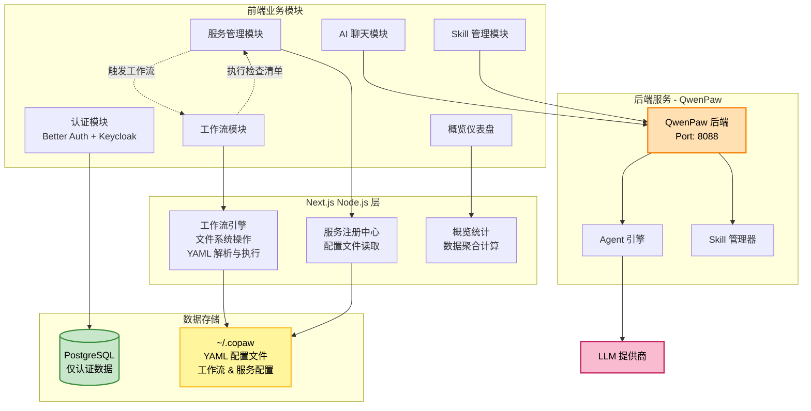

# Hi-Ops 业务架构图

```mermaid
graph TB
    subgraph "前端业务模块"
        direction LR
        Auth["认证模块<br/>Better Auth + Keycloak"]
        Chat["AI 聊天模块"]
        Skill["Skill 管理模块"]
        Services["服务管理模块"]
        Workflow["工作流模块"]
        Overview["概览仪表盘"]
    end
    
    subgraph "Next.js Node.js 层"
        direction LR
        WorkflowEngine["工作流引擎<br/>文件系统操作<br/>YAML 解析与执行"]
        ServiceRegistry["服务注册中心<br/>配置文件读取"]
        OverviewStats["概览统计<br/>数据聚合计算"]
    end
    
    subgraph "后端服务 - QwenPaw"
        direction LR
        Backend["QwenPaw 后端<br/>Port: 8088"]
        AgentEngine["Agent 引擎"]
        SkillManager["Skill 管理器"]
    end
    
    subgraph "数据存储"
        DB[("PostgreSQL<br/>仅认证数据")]
        FileSystem["~/.copaw<br/>YAML 配置文件<br/>工作流 & 服务配置"]
    end
    
    LLM["LLM 提供商"]
    
    Auth --> DB
    Chat --> Backend
    Skill --> Backend
    Workflow --> WorkflowEngine
    Services --> ServiceRegistry
    Overview --> OverviewStats
    
    Backend --> AgentEngine
    Backend --> SkillManager
    AgentEngine --> LLM
    
    WorkflowEngine --> FileSystem
    ServiceRegistry --> FileSystem
    
    Workflow -.->|执行检查清单| Services
    Services -.->|触发工作流| Workflow
    style Backend fill:#ffe0b2,stroke:#f57c00,stroke-width:2px,color:#000000
    style DB fill:#c8e6c9,stroke:#388e3c,stroke-width:2px,color:#000000
    style LLM fill:#f8bbd0,stroke:#c2185b,stroke-width:2px,color:#000000
    style FileSystem fill:#fff59d,stroke:#fbc02d,stroke-width:2px,color:#000000
```
